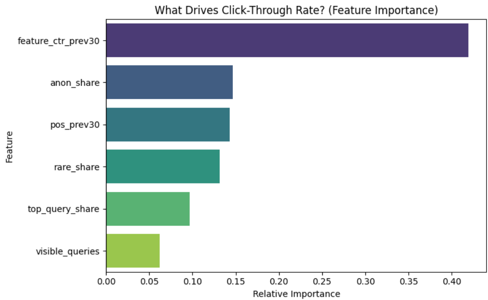

# Decoding Search Visibility: A Ranking Signal Analysis of Click-Through Rates

## Abstract
This research investigates which historical and query-level signals most strongly drive search Click-Through Rate (CTR) beyond raw ranking position. Using the FlyRank ML Internship dataset, we engineered features including 30-day momentum, query concentration, and visibility metrics. We trained a Random Forest Regressor and validated it across distinct client sets using `GroupShuffleSplit`. The model successfully outperformed a historical baseline, revealing that historical click-through rate (`feature_ctr_prev30`) and anonymized query share (`anon_share`) are the most critical secondary drivers of clicks. These findings allow content teams to prioritize specific optimizations for pages underperforming their expected CTR.

## Introduction / Problem Statement
Ranking highly in search results is only half the battle; capturing the click is the final conversion. Content teams often struggle to prioritize which pages to optimize. This analysis supports the decision of *where to allocate editorial resources* by identifying the specific signals that maximize CTR, allowing teams to intervene when a page's clicks are declining.

## Data
* **Source:** FlyRank ML Internship dataset (Release: internship-warehouse).
* **Tables Used:** `fact_content_daily_performance`, `fact_content_query_90d`.
* **Date Window:** We utilized a 60-day rolling window to prevent data leakage.
* **Exclusions:** We strictly excluded any URL with fewer than 100 impressions in either the previous 30-day or last 30-day windows to prevent low-volume mathematical noise (e.g., 1 impression and 1 click artificially creating a 100% CTR).

## Methodology
* **Label Definition:** `target_ctr_last30` was calculated as `SUM(clicks) / SUM(impressions)` over the target 30-day window.
* **Features:** Features were strictly engineered from the *previous* 30-day window (`pos_prev30`, `feature_ctr_prev30`) and 90-day query mix (`rare_share`, `top_query_share`, `visible_queries`).
* **Baseline:** The baseline model conservatively predicted that a page's target CTR would simply equal its historical CTR (`feature_ctr_prev30`).
* **Validation Design:** We implemented a `GroupShuffleSplit` on `client_hash_id` (75/25 split). This strict cross-client validation ensures the model generalizes to unseen domains and prevents client data leakage.

## Results
The Random Forest model successfully learned signal interactions that the baseline could not capture, proving generalization across unseen clients.
* **Baseline Mean Absolute Error (MAE):** 0.00285
* **Model MAE:** 0.00273

## Limitations
This model provides **directional, decision-support guidance**, not causal certainty. We observed strong associations between our top features and CTR, but this does not definitively prove that altering these metrics will force Google's algorithm to award more clicks. 

## Ranked Recommendations (Action Playbook)
Based on the feature importances, content teams should execute the following playbook:

1. **Optimize for Niche, Long-Tail Intent (`anon_share` & `rare_share`):** Combined, the share of anonymized and rare queries accounts for nearly 28% of the model's predictive power—making query type more important than raw ranking position. Pages with high anonymized query shares are likely pulling in hyper-specific, conversational searches. **Action:** Content teams should shift focus away from stuffing broad, high-volume keywords and instead structure pages to answer highly specific, long-tail user questions directly.
2. **Prioritize Meta-Testing on "Lagging" Pages (`feature_ctr_prev30`):** Past CTR dictates future CTR (accounting for ~42% of the model's importance). Once a page develops a poor click-through reputation, it tends to stay that way. **Action:** SEO teams should set up automated alerts for pages that rank on Page 1 (`pos_prev30` < 10) but fall below the baseline expected CTR. These pages should be immediately flagged for A/B testing of their Title Tags and Meta Descriptions to break the cycle of low historical clicks.
3. **Focus on Position Consolidation (`pos_prev30`):** Ranking position remains a critical baseline driver (~14%). **Action:** Instead of publishing new content, teams should identify existing pages sitting in "striking distance" (positions 5 through 10) and refresh their content to bump them into the top 3 spots, which will yield an exponentially higher CTR.

## Reproducibility
All SQL extraction queries, feature engineering logic, and modeling code are available in the public repository.
* **GitHub Repository:** https://github.com/7enno/HananAlawawdaRepository
* **Execution:** Run `work/capstone_ctr_model.ipynb`.

## Acknowledgments
Built on the FlyRank ML Internship dataset. Data provided by [FlyRank](https://flyrank.ai).
